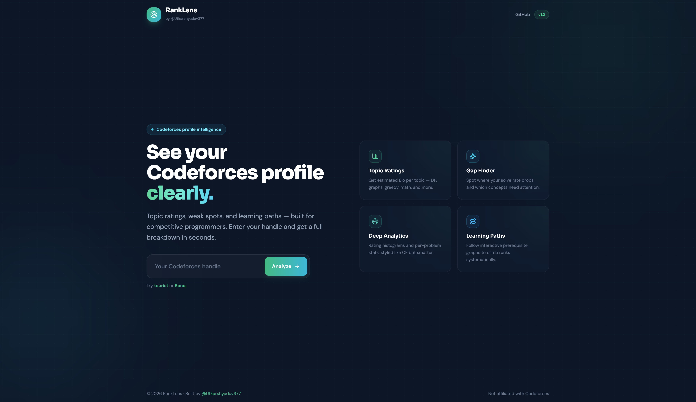
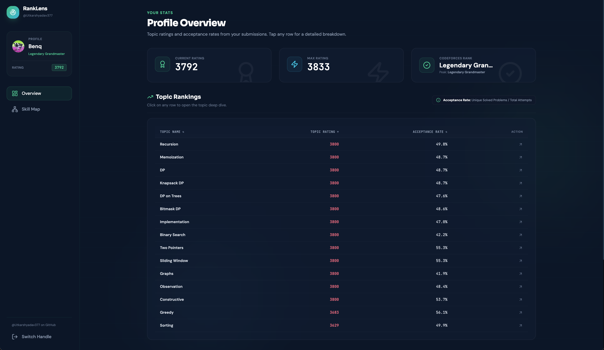
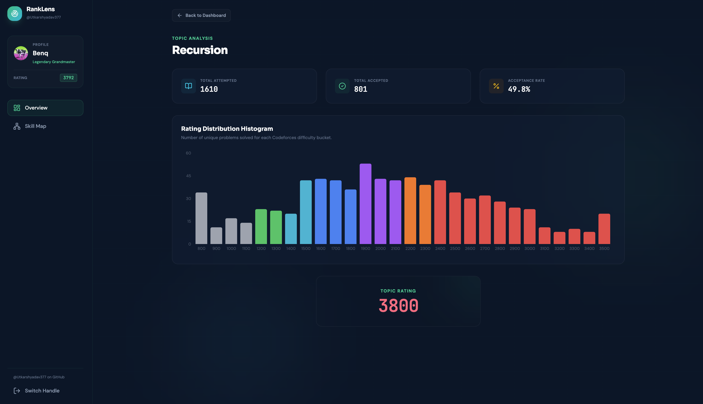
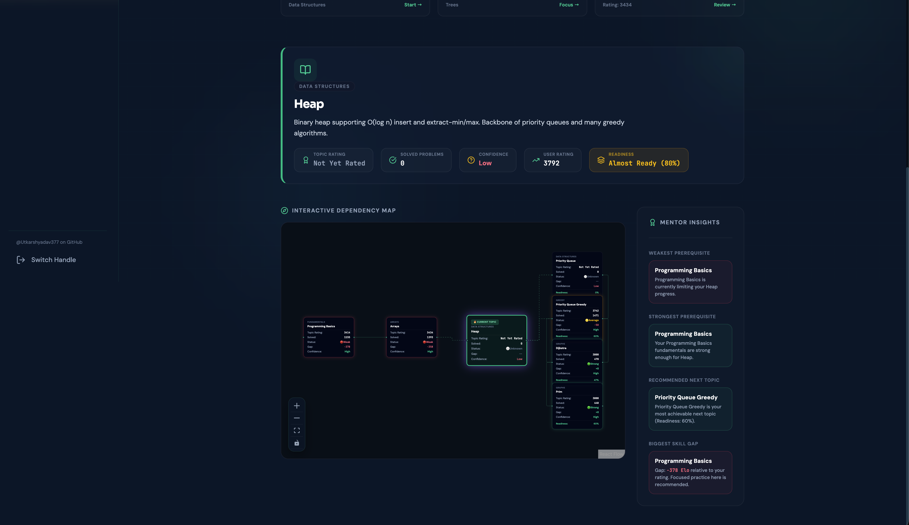

# 🚀 RankLens

<p align="center">
  
</p>

<h1 align="center">RankLens</h1>

<p align="center">
<b>AI-Powered Codeforces Analytics Platform</b>
</p>

<p align="center">
Transform your Codeforces profile into actionable insights with topic-wise ratings, personalized learning paths, interactive dependency graphs, and deep performance analytics.
</p>

<p align="center">

[](https://react.dev/)
[](https://www.typescriptlang.org/)
[](https://vitejs.dev/)
[](https://tailwindcss.com/)
[](https://www.framer.com/motion/)
[](LICENSE)

</p>

<p align="center">

🌐 **Live Demo:** https://ranklens-eight.vercel.app/

⭐ **Repository:** https://github.com/Utkarshyadav377/RankLens

</p>

---

# 📖 Overview

RankLens is an AI-powered analytics platform built for competitive programmers.

Instead of only showing your Codeforces rating, RankLens analyzes your submissions to estimate topic-wise strengths, identify weak concepts, recommend personalized learning paths, and visualize prerequisite relationships between algorithms and data structures.

Whether you're targeting Specialist, Candidate Master, or Legendary Grandmaster, RankLens helps you practice smarter—not just harder.

---

# ✨ Features

## 📊 Topic Rating Estimation

Estimate your effective rating across every major competitive programming topic.

Supports topics including:

- Dynamic Programming
- Graphs
- Trees
- Binary Search
- Greedy
- Two Pointers
- Sliding Window
- Strings
- Number Theory
- Geometry
- Constructive Algorithms
- Bitmask DP
- Recursion
- Memoization
- and many more...

---

## 🎯 Gap Finder

Discover exactly what's limiting your Codeforces growth.

RankLens identifies

- Weakest topics
- Low acceptance-rate concepts
- Under-practiced areas
- Highest-impact improvements
- Rating bottlenecks

---

## 📈 Deep Performance Analytics

Understand your programming performance with detailed visualizations.

Includes

- Topic-wise ratings
- Acceptance rates
- Solved problems
- Submission statistics
- Performance distribution
- Difficulty analysis
- Overall profile summary

---

## 🧠 Personalized Learning Paths

RankLens doesn't just tell you what's weak.

It tells you what to learn next.

Receive recommendations based on

- Prerequisite completion
- Current rating
- Topic readiness
- Learning confidence
- Skill dependencies

---

## 🌳 Interactive Skill Map

Visualize prerequisite relationships between algorithms and data structures.

The interactive dependency graph helps you

- Understand concept hierarchy
- Plan your learning roadmap
- Discover prerequisite gaps
- Learn systematically

---

## ⚡ Instant Analysis

Simply enter your Codeforces handle.

RankLens automatically analyzes your public profile and generates a complete dashboard within seconds.

---

# 📸 Screenshots

## 🏠 Landing Page

Modern landing page designed for competitive programmers.


---

## 📊 Profile Overview

View your overall rating, topic-wise estimates, acceptance rates, and performance statistics.



---

## 🧠 Personalized Learning Path

Receive AI-inspired recommendations on what to study next based on your current skills.



---

## 🌳 Interactive Dependency Graph

Explore prerequisite relationships and discover the optimal order to master algorithms.



---

# 🚀 Tech Stack

| Category | Technologies |
|------------|--------------|
| Frontend | React 18 |
| Language | TypeScript |
| Build Tool | Vite |
| Styling | Tailwind CSS |
| Animations | Framer Motion |
| Charts | Recharts |
| Graph Visualization | React Flow |
| Routing | React Router |
| Deployment | Vercel |

---

# ⚙️ Local Development

Clone the repository

```bash
git clone https://github.com/Utkarshyadav377/RankLens.git
```

Navigate into the project

```bash
cd RankLens
```

Install dependencies

```bash
npm install
```

Start the development server

```bash
npm run dev
```

Open

```
http://localhost:5173
```

Build for production

```bash
npm run build
```

Preview production build

```bash
npm run preview
```

---

# 📂 Project Structure

```
RankLens
│
├── public/
├── screenshots/
│   ├── landing.png
│   ├── dashboard.png
│   ├── learning-path.png
│   └── skill-map.png
│
├── src/
│   ├── assets/
│   ├── components/
│   ├── hooks/
│   ├── pages/
│   ├── services/
│   ├── utils/
│   ├── data/
│   └── App.tsx
│
├── package.json
├── vite.config.ts
└── README.md
```

---

# 🎯 Why RankLens?

Traditional Codeforces analytics only answer one question:

> "What is my rating?"

RankLens answers much more.

✅ Which topics are limiting my growth?

✅ Which algorithms should I learn next?

✅ How balanced is my skill set?

✅ Which prerequisites am I missing?

✅ What is my strongest topic?

✅ What should I practice today?

Instead of guessing your next step, RankLens provides a structured roadmap toward becoming a stronger competitive programmer.

---

# 🗺️ Roadmap

Upcoming features

- [ ] Contest prediction model
- [ ] AI Mentor
- [ ] Personalized practice recommendations
- [ ] Compare two Codeforces users
- [ ] Contest history analysis
- [ ] Daily practice planner
- [ ] PDF report export
- [ ] Progress tracking
- [ ] Achievement system
- [ ] Codeforces API caching
- [ ] Dark/Light theme toggle

---

# 🤝 Contributing

Contributions are welcome!

1. Fork this repository

2. Create a new branch

```bash
git checkout -b feature/amazing-feature
```

3. Commit your changes

```bash
git commit -m "Add amazing feature"
```

4. Push the branch

```bash
git push origin feature/amazing-feature
```

5. Open a Pull Request

---

# 📄 License

This project is licensed under the MIT License.

---

# ⚠️ Disclaimer

RankLens is an independent project and is **not affiliated with, endorsed by, or sponsored by Codeforces**.

All analytics are generated using publicly available Codeforces profile and submission data.

---

# 👨‍💻 Author

**Utkarsh Yadav**

GitHub: https://github.com/Utkarshyadav377

Project: https://github.com/Utkarshyadav377/RankLens

---

# ⭐ Support

If you found this project helpful or interesting, consider giving it a ⭐ on GitHub.

It helps others discover the project and motivates future development.

---

<p align="center">
Made with ❤️ using React, TypeScript, Vite, Tailwind CSS, and modern web technologies.
</p>
